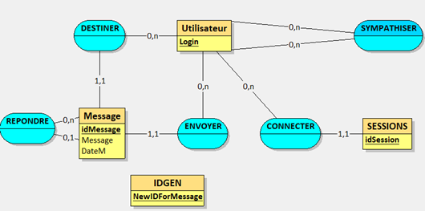

# Présentation du projet :

### Contexte
LinkSphere est une application de messagerie permettant aux utilisateurs de communiquer les uns avec les autres. Grâce à une base de données SQL sous-jacente, l'application gère les utilisateurs et les messages de manière efficace.

### Fonctionnalités
Les fonctionnalités principales de l'application sont l'envoi de messages entre utilisateurs, la sympathisation entre utilisateurs, et le partage d'informations sur le mur de l'utilisateur.

## MCD

## MLD

Utilisateur (<ins>Login</ins>) 
Message (<ins>IdMessage</ins>, Message, DateM, #IdMessageRéponse, #Destinataire, #Expediteur) 
Sympathiser(<ins>#Login,#Ami</ins>) 
Session(<ins>idSession</ins>,#Login) 
IdGen(<ins>NewIDForMessage</ins>) 

## Road MAP

- [x] Envoyer des messages
- [x] Crée un compte
- [x] Symphatiser avec un utilisateur
- [ ] Test de conformité
- [ ] Mettre un mot de passe pour la connexion
- [ ] Faire une liste d'attente de sympathisation
- [ ] Gerer les identifiant pour les message par le SGBD
- [ ] Faire des groupes de discution